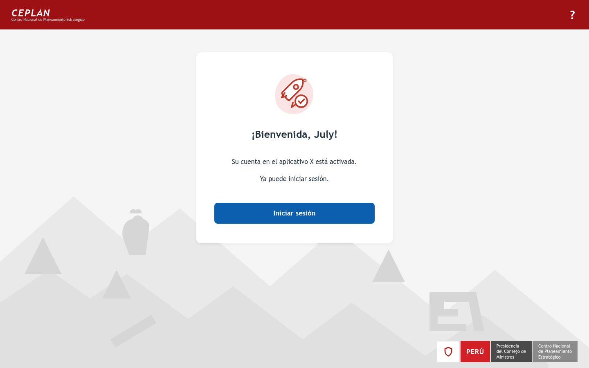
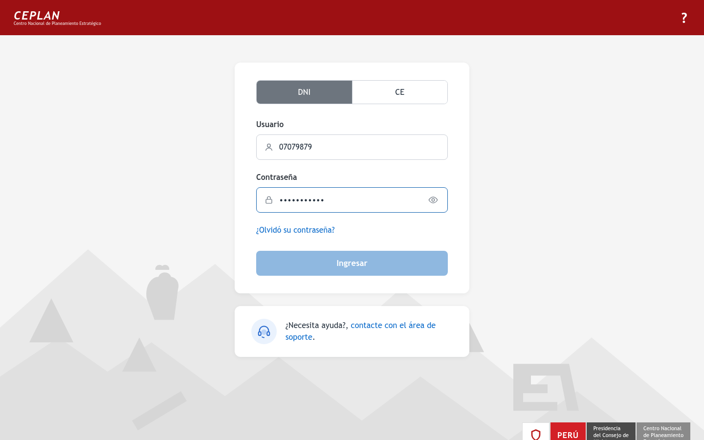
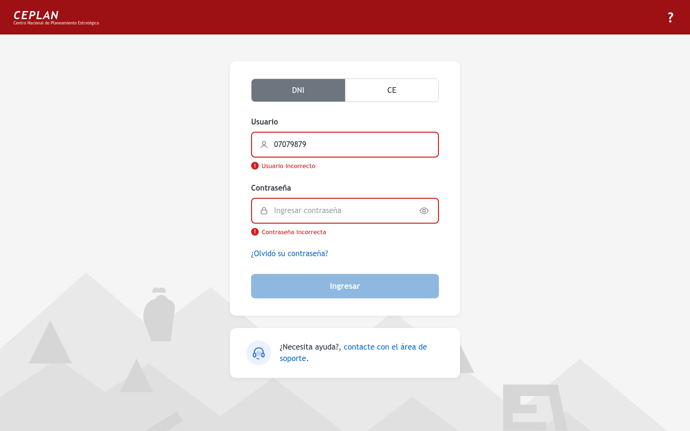
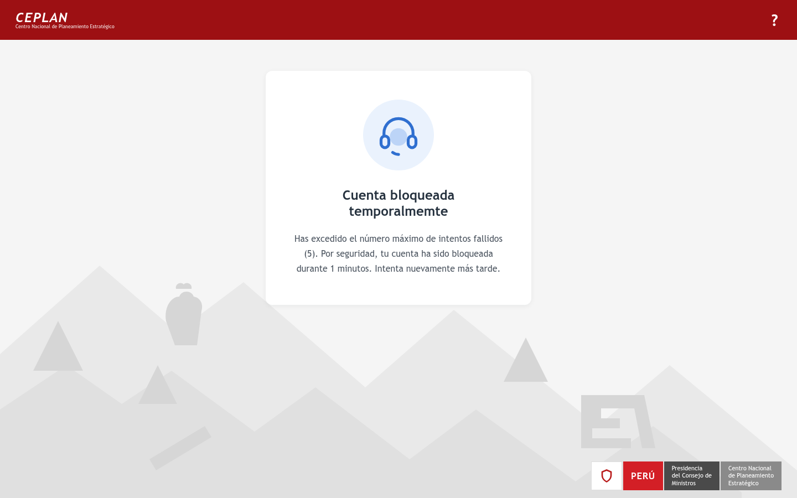
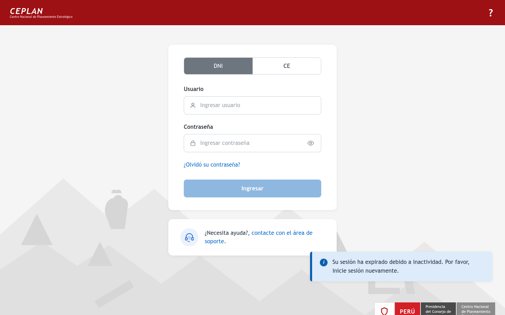
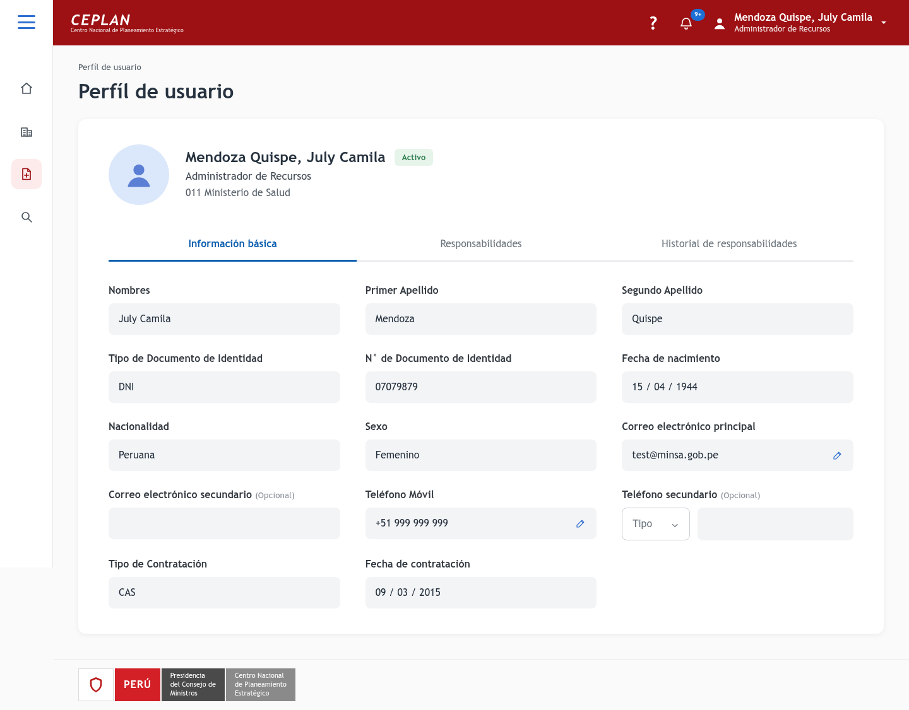
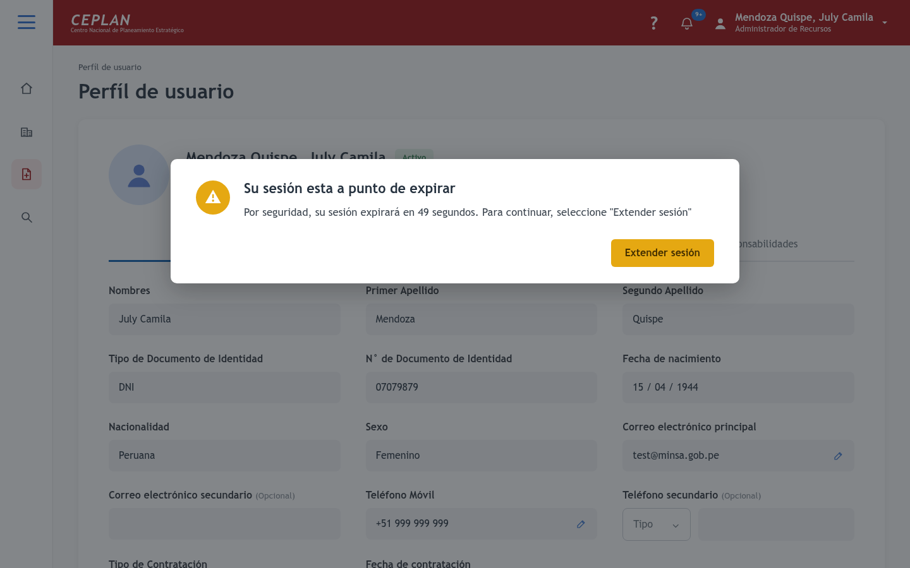
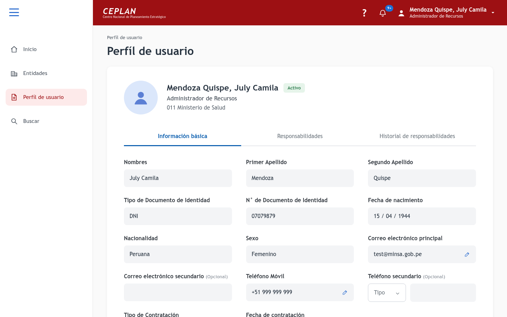
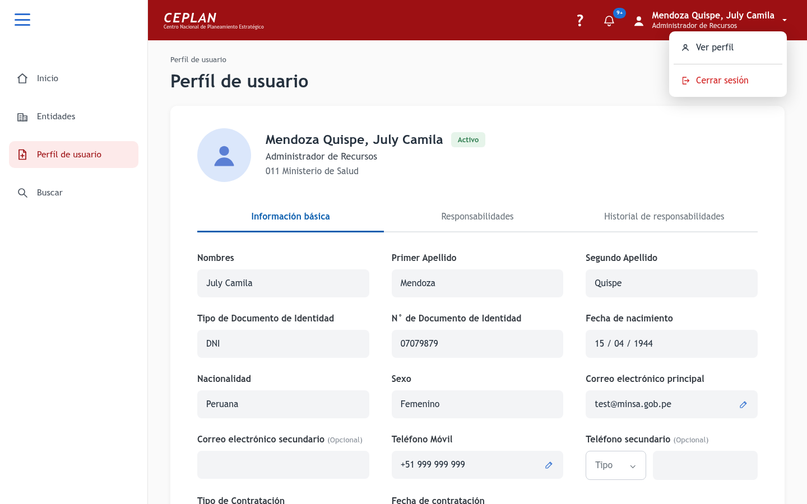
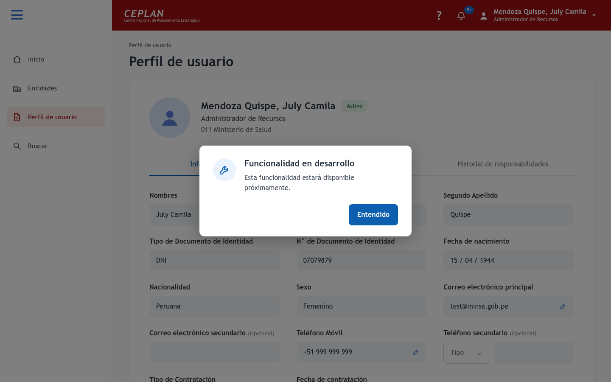

# Ceplan (AHVA technical test)

Aplicación web que replica el flujo de inicio de sesión del diseño de Figma (portal estilo CEPLAN):
bienvenida → login por DNI/CE → perfil de usuario, con bloqueo de cuenta (5 intentos / 15 min) y
expiración de sesión por inactividad (20 min) con diálogo para extenderla.

## Stack

- **ASP.NET Core** (.NET 10) con **Aspire** para orquestar la app distribuida.
- **SQL Server** en contenedor (podman/docker) provisto por el AppHost de Aspire.
- **Razor Pages + Bootstrap + jQuery** en el Portal; interacciones en JavaScript
  (toggle DNI/CE, mostrar/ocultar contraseña, habilitación del botón, contador de expiración de sesión).
- **ASP.NET Core Identity + JWT (Bearer)** en la WebApi, con Swagger.
- **EF Core** (migraciones en el proyecto Data, se aplican y siembran datos al arrancar la API).
- **Refit** como cliente tipado de la API (proyecto WebApi.Client), consumido por el Portal.

## Estructura (onion-ish)

| Proyecto | Rol |
| --- | --- |
| `lib/Shared.ApiResponses` | Wrappers estándar de respuesta (`ok`, `data`, paginación, `errors`) |
| `src/Contracts` | DTOs (`UserInput`/`UserOutput`/`UserFilter`, `LoginInput`, …) |
| `src/Data` | `ApplicationDbContext` (Identity) + entidad `UserProfile` + migraciones |
| `src/Domains` | Servicios de lógica (`AuthService`, `UserCrudService`, `UserListingService`) y mappers a mano |
| `src/WebApi` | Minimal APIs, Identity + lockout, JWT, middleware de excepciones, Swagger, seeding |
| `src/WebApi.Client` | Cliente Refit |
| `src/Portal` | UI Razor Pages (réplica del Figma), autenticación por cookie contra la API |
| `src/AppHost` / `src/ServiceDefaults` | Aspire |
| `test/*` | Unit (Domains), integración (WebApi, Aspire.Hosting.Testing), e2e (Portal, Playwright) |

## Cómo ejecutar

Requisitos: .NET 10 SDK y docker o podman.

```bash
dotnet run --project src/AppHost --launch-profile https
```

El dashboard de Aspire muestra las URLs; por defecto el Portal queda en <https://localhost:7179>
y la API (Swagger en `/swagger`) en <https://localhost:7051>. El primer arranque descarga la
imagen de SQL Server, aplica migraciones y siembra usuarios.

> En máquinas con podman en lugar de docker, configurar (una sola vez):
> `dotnet user-secrets set "DcpPublisher:ContainerRuntime" "podman" --project src/AppHost`

## Credenciales de prueba

| Usuario (DNI) | Contraseña | Perfil |
| --- | --- | --- |
| `07079879` | `Ceplan#2026` | Mendoza Quispe, July Camila — Administrador de Recursos |
| `46844596` | `Ceplan#2026` | Osorio Montes, Adriana — Operador |

## Flujos implementados

- Bienvenida (`/`) → Iniciar sesión (`/Login`).
- Login con toggle DNI/CE; credenciales inválidas marcan ambos campos en rojo.
- 5 intentos fallidos → cuenta bloqueada 15 minutos (`/Bloqueado`, HTTP 423 desde la API).
- Login correcto → `/Perfil` (datos desde `GET /api/auth/me` con el bearer emitido).
- Inactividad: al faltar 60 s para expirar la sesión aparece el diálogo con cuenta regresiva;
  «Extender sesión» renueva el token vía `POST /session/extend`; si expira, vuelve al login
  con el aviso «Su sesión ha expirado debido a inactividad».

## Capturas de pantalla

Capturas reales de la aplicación en ejecución (en `docs/screenshots/`).

### Flujo de inicio de sesión

| Bienvenida | Inicio de sesión | Con credenciales |
| --- | --- | --- |
|  |  |  |

| Credenciales incorrectas | Cuenta bloqueada | Sesión expirada |
| --- | --- | --- |
|  |  |  |

### Perfil y sesión

| Perfil de usuario | Sesión a punto de expirar |
| --- | --- |
|  |  |

| Menú expandido | Menú de usuario | Funcionalidad en desarrollo |
| --- | --- | --- |
|  |  |  |

## Tests

```bash
dotnet test                       # unit + integración + e2e
```

Los tests de integración y e2e levantan la app completa con `Aspire.Hosting.Testing`
(requieren el runtime de contenedores). Para el e2e, si Playwright no tiene navegadores
instalados: `pwsh test/Portal.Tests/bin/Debug/net10.0/playwright.ps1 install chromium`
(o exportar `CEPLAN_E2E_BROWSER` apuntando a un Chromium existente).
