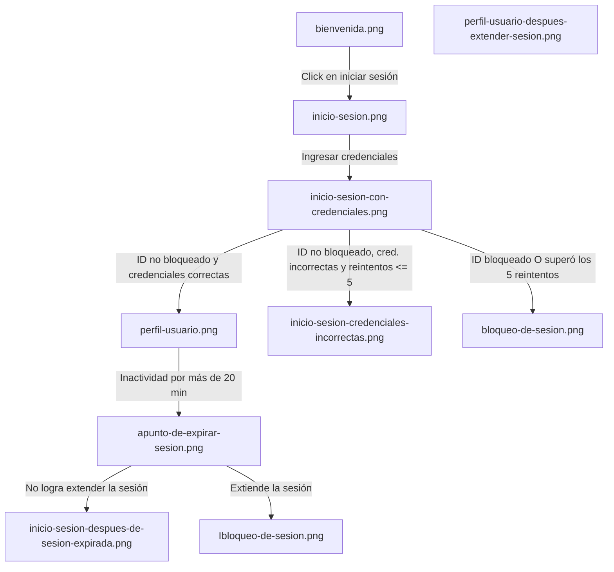

# Flujo

1. Entrypoint: bienvenida.png
2. Al darle click iniciar sesión en bienvenida: inicio-sesion.png
3. Al ingresar credenciales: inicio-sesion-con-credenciales.png
4. Si el ID de la cuenta no esta bloqueada y las credenciales son correctas: perfil-usuario.png
5. Si despues de iniciar sesión el usuario se inactiva por más de 20 minutos: apunto-de-expirar-sesion.png
6. Si no logra extender sesion: inicio-sesion-despues-de-sesion-expirada.png
7. Si extendio la sesión: perfil-usuario-despues-extender-sesion.png
8. Si el ID de la cuenta no esta bloqueada y las credenciales son incorrectas y no ha superado el máximo de 5 reintentos: inicio-sesion-credenciales-incorrectas.png
9. Si el ID de la cuenta está bloqueada o las credenciales son incorrectas y supero el máximo de 5 reintentos: bloqueo-de-sesion.png

## Diagrama

